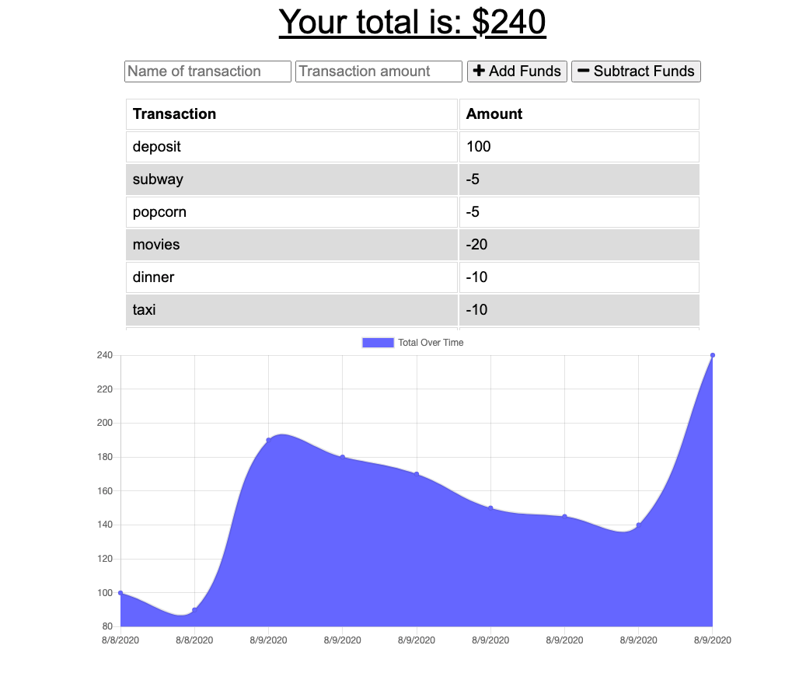

# Unit 18 PWA Homework: Online/Offline Budget Trackers

## Description 

The user will be able to add expenses and deposits to their budget with or without a connection. When entering transactions offline, they should populate the total when brought back online.

Offline Functionality:

Enter deposits offline

Enter expenses offline

When brought back online:

Offline entries should be added to tracker.

## User Story

AS AN avid traveller I WANT to be able to track my withdrawals and deposits with or without a data/internet connection SO THAT my account balance is accurate when I am traveling

### App screenshot

   

## Table of contents

- [Description](#Description)
- [Usage](#Usage)
- [Licence](#Licence)
- [Contributors](#Contributors)
- [Test](#Test)
- [Repository Link](#Repository)
- [GitHub Info](#GitHub) 

## Usage

Go to [Budget App](https://budget-app1200.herokuapp.com) and control your expenses

## Licence

## Contributors

## Test

## Repository

- [Project Repo](https://github.com/hoffman1200/Homework-18)
- [Budget App](https://budget-app1200.herokuapp.com)

## GitHub

- Fernando Soto
- [GitHub Profile](https://github.com/hoffman1200)

